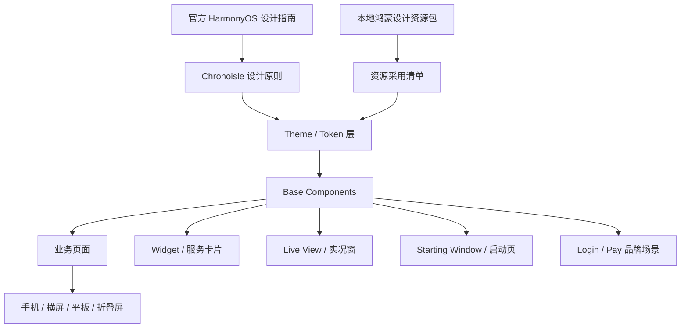

# Chronoisle2 HarmonyOS 最新设计资源落地方案

更新日期：2026-04-29

适用范围：Chronoisle2 HarmonyOS ArkUI 主应用、桌面卡片、启动页、登录/支付等品牌场景、后续实况窗与多设备适配。

关联文档：

- `docs/design/harmonyos/harmonyos-next-ui-upgrade-plan.md`
- `docs/design/harmonyos/harmonyos-next-adaptation-matrix.md`
- `docs/design/ui/ui-style-guide.md`

参考来源：

- 华为设计指南：https://developer.huawei.com/consumer/cn/doc/design-guides/design-concepts-0000001795698445
- HarmonyOS 设计理念：https://developer.huawei.com/consumer/cn/design/concept/
- HarmonyOS 设计资源：https://developer.huawei.com/consumer/cn/design/resource-V1/
- HarmonyOS Symbol 系统图标：https://developer.huawei.com/consumer/cn/design/harmonyos-symbol/HarmonyOS
- 本地资源包：`C:\Users\fangj\Downloads\鸿蒙设计资源`

## 1. 结论

Chronoisle2 可以切换到最新版 HarmonyOS 设计风格，也可以分批把核心组件切到这套设计语言。

但落地方式必须是“设计系统迁移”，不是“资源包整体导入”。本地资源包里大量内容是 Pixso/Sketch 设计源、字体源文件和品牌素材，它们不能直接替代 ArkUI 运行时组件。正确路径是：

1. 把官方设计语言转译为 Chronoisle2 的主题、token 和组件规范。
2. 把 HarmonyOS Symbol 接入为统一图标语义层。
3. 把本地资源包分类为运行时可用资产、设计参照资产、品牌限定资产、系统场景资产。
4. 先迁移基础组件，再迁移页面，再迁移系统入口。
5. 每一期都有构建、截图、真机或模拟器验证，不以“资源已复制”作为完成标准。

一句话目标：

> 把 Chronoisle2 从“已有统一 UI 组件的 ArkUI 应用”升级为“符合最新版 HarmonyOS 设计语言、可跨手机/平板/折叠屏/桌面卡片/实况窗演进的执行控制台”。

## 2. 设计方向定义

### 2.1 产品气质

Chronoisle2 不是营销型应用，也不是内容消费型应用。新版 UI 必须继续服务于个人执行管理：

- 今天要做什么，一眼可见。
- 任务、提醒、目标、专注、AI 调度之间关系清楚。
- 信息密度较高，但层次清晰。
- 系统能力是效率入口，不是视觉噱头。
- AI 能力应该像助手嵌入流程，而不是占据页面叙事。

### 2.2 HarmonyOS 风格转译

结合官方设计资源，Chronoisle2 采用以下转译口径：

| 官方方向 | Chronoisle2 转译 | 具体落点 |
| --- | --- | --- |
| 自然、流畅、直觉 | 页面结构减少跳转摩擦，状态反馈明确 | 按钮、列表、弹层、创建流程 |
| 统一系统语言 | App 内、Widget、实况窗图标和语义一致 | `AppIcon`、Widget 图标、Live View 图标 |
| HarmonyOS Sans | 用系统字体语义和必要字体文件支撑中文阅读 | `TypographyTokens.ets`、`rawfile/fonts` |
| Symbol 系统图标 | 统一图标语义层，Symbol 优先，fallback 兜底 | `AppIcon.ets`、`IconTokens.ets` |
| 卡片化与轻层次 | 卡片承载任务/提醒/目标，但避免卡片套卡片 | `AppCard`、`AppPanelSection` |
| 多设备一致 | 手机优先，宽屏主辅布局，折叠屏/平板栅格化 | `PageDensityTokens`、各主 Tab |
| 系统入口协同 | Widget、启动页、实况窗、账号登录、分享形成一套体验 | `widget/*`、`LoginPage`、后续 `LiveViewService` |

### 2.3 不采用的误区

1. 不把 Pixso/Sketch 文件当成运行时代码。
2. 不把所有字体文件全部打包进应用。
3. 不把华为账号、支付、默认头像素材泛化成普通 UI 装饰。
4. 不为“全规范支持”强接和产品无关的能力。
5. 不在页面里手写新视觉规则，必须先进入 token 或基础组件。
6. 不在当前 dirty worktree 上做不可回溯的大面积替换。

## 3. 本地资源包盘点

本地目录：`C:\Users\fangj\Downloads\鸿蒙设计资源`

### 3.1 资源目录

| 目录 | 类型 | 是否可直接入包 | 落地策略 |
| --- | --- | --- | --- |
| `HarmonyOS Sans 字体` | 字体源文件 | 条件可入包 | 只挑必要字重，保留 license，声明字体使用 |
| `HarmonyOS+Sans+字体` | 字体源文件副本 | 不直接入包 | 与上一个目录重复，作为备份，不重复打包 |
| `HarmonyOS 应用图标` | Pixso/Sketch 应用图标设计源 | 不直接入包 | 用于 App 图标复核与生成规范，不直接复制 |
| `HarmonyOS 服务组件库` | Widget 组件设计源 | 不直接入包 | 用于桌面卡片视觉重构参照 |
| `手机折叠屏平板` | 多端组件设计源 | 不直接入包 | 用于响应式和宽屏组件参照 |
| `启动页设计资源` | 启动页设计源 | 条件采用 | 用于 Starting Window / Splash 改造 |
| `实况窗设计资源` | Live View 设计源 | 条件采用 | P5 接入实况窗时使用 |
| `使用华为账号登录` | 华为账号品牌素材 | 仅登录场景 | 只在华为账号登录按钮/说明中使用 |
| `华为支付图标` | 华为支付品牌素材 | 仅支付场景 | 只在真实华为支付链路中使用 |
| `元服务静默登录默认头像` | 默认头像素材 | 条件采用 | 只在对应账号/元服务默认头像场景使用 |

### 3.2 文件类型统计

| 类型 | 数量 | 处理策略 |
| --- | ---: | --- |
| `.ttf` | 120 | 去重，只保留必要中文简体 Regular/Medium/Bold |
| `.png` | 7 | 按品牌和系统场景筛选，不批量导入 |
| `.svg` | 4 | 只用于品牌限定场景或设计参考 |
| `.pix` | 6 | 设计源文件，不进运行时 |
| `.sketch` | 6 | 设计源文件，不进运行时 |
| `.ai` | 1 | 支付品牌源文件，不进运行时 |
| `.gif` | 1 | 登录 loading 场景可评估 |
| `.txt` | 2 | license，需要随字体使用记录保留 |

### 3.3 已进入项目的资源

当前项目已存在字体资源：

- `entry/src/main/resources/rawfile/fonts/HarmonyOS_SansSC_Regular.ttf`
- `entry/src/main/resources/rawfile/fonts/HarmonyOS_SansSC_Medium.ttf`
- `entry/src/main/resources/rawfile/fonts/HarmonyOS_SansSC_Bold.ttf`

这三档基本满足当前中文界面：

- Regular：正文、说明、列表内容。
- Medium：按钮、分区标题、状态标签。
- Bold：一级标题、关键数字、Hero 强调。

暂不建议继续导入 Light、Thin、Black、Italic、Condensed、Arabic、TC 等字重/语种，原因：

1. 包体会显著变大。
2. 当前产品没有复杂多语排版需求。
3. 过多字重会削弱界面稳定性。
4. HarmonyOS 设备上系统字体已能覆盖大量场景。

### 3.4 字体 license 注意事项

本地 `LICENSE-update.txt` 显示 HarmonyOS Sans Fonts License 允许在软件中使用、嵌入、打包和再分发未修改字体，但有条件：

1. 软件内需要明确声明使用了 HarmonyOS Sans Fonts。
2. 不得修改字体文件。
3. 不得单独转售或单独分发字体。
4. 需要保留版权声明和许可协议。

落地要求：

- 在 `docs/reference/third-party-notices.md` 或等价文档中记录 HarmonyOS Sans license。
- 字体文件保持原名或可追溯命名，不做字体二次编辑。
- 不把完整字体包暴露为独立下载资源。

## 4. 当前项目承载能力

### 4.1 已有设计系统基础

当前代码已经具备三层结构：

| 层级 | 文件/目录 | 作用 |
| --- | --- | --- |
| 主题层 | `entry/src/main/ets/theme/AppTheme.ets` | 亮暗主题、语义色 |
| Token 层 | `entry/src/main/ets/foundation/tokens/*` | 字体、间距、圆角、阴影、图标、动效、页面密度 |
| 基组件层 | `entry/src/main/ets/ui/base/*` | Button、Card、Chip、ListRow、SearchBar、Icon 等 |

这意味着新版 HarmonyOS 设计资源可以被工程化承接，不需要从页面散改开始。

### 4.2 关键基础组件

| 组件 | 当前角色 | 新版迁移重点 |
| --- | --- | --- |
| `AppButton` | 主/次/危险/文字按钮 | 尺寸、图标、loading、pressed、focus、disabled |
| `AppCard` | 页面内容承载 | HarmonyOS 卡片层次、交互态、轻阴影、边框 |
| `AppChip` | 筛选和轻状态 | 选中态、状态色、键鼠反馈 |
| `AppListRow` | 设置、表单、列表行 | 热区、右侧动作、可访问性、焦点 |
| `AppSearchBar` | 搜索输入 | 聚焦、清除、禁用、输入态 |
| `AppSegmentTabs` | 分段切换 | 选中态、滑块感、键鼠反馈 |
| `AppPageHeader` | 页面顶部结构 | 安全区、标题压缩、返回/保存按钮 |
| `AppStatusBadge` | 状态标签 | 语义色统一、文字密度 |
| `AppTaskRow` | 任务行 | 状态、操作、点击路径、Symbol 化 |
| `AppReminderCard` | 提醒卡片 | 时间/重复/状态可读性 |
| `AppGoalCard` | 目标卡片 | 进度、层级、目标语义图标 |
| `AppIcon` | 业务语义图标 | HarmonyOS Symbol 适配核心 |
| `AppHeroPanel` | 强调区 | 今日计划/AI 入口等关键模块 |
| `AppPanelSection` | 页面分区 | 统一分区标题和内容间距 |

### 4.3 当前短板

1. `AppIcon` 仍以本地绘制语义图形为主，尚未接入 HarmonyOS Symbol。
2. 设计资源和代码之间缺少“采用清单”，容易误把素材直接复制进项目。
3. Widget 资源、实况窗资源、启动页资源尚未和主应用设计系统建立映射。
4. 响应式适配已有 TodayTab 试点，但还没有扩展到任务、统计、日历和表单。
5. 华为账号/支付素材需要按品牌规则进入具体业务页，不能先导入再寻找用途。

## 5. 总体架构方案

### 5.1 目标架构



### 5.2 代码分层

| 分层 | 目标 | 文件 |
| --- | --- | --- |
| Design Source | 记录官方和本地资源引用 | `docs/design/harmonyos/harmonyos-vnext-resource-adoption-plan.md` |
| Resource Registry | 记录资源采用/不采用 | 建议新增 `docs/design/resources/harmonyos-resource-inventory.md` |
| Theme | 语义色和主题 | `AppTheme.ets`、`ThemeSemantics.ets` |
| Tokens | 尺寸、字重、圆角、动效、图标 | `foundation/tokens/*` |
| Icon Adapter | Symbol 映射和 fallback | `ui/base/AppIcon.ets`、`IconTokens.ets` |
| Components | 基础组件 | `ui/base/*` |
| Layout Helpers | 响应式布局 | `PageDensityTokens.ets`，后续可新增 helper |
| Product Pages | 业务页面 | `components/*`、`pages/*` |
| System Surfaces | 系统入口 | `widget/*`、启动页、实况窗、登录/支付 |

### 5.3 资源导入原则

所有资源进入 `entry/src/main/resources` 前必须回答六个问题：

1. 用在什么产品场景？
2. 是否有运行时需要？
3. 是否能用系统能力替代？
4. 是否有 license 或品牌限制？
5. 是否会增加包体和维护成本？
6. 是否有降级方案？

判断结果：

| 结论 | 处理 |
| --- | --- |
| 运行时必需 | 导入项目资源目录 |
| 设计参照 | 保留在下载目录或设计源，不入包 |
| 品牌限定 | 只进入对应业务页 |
| 系统能力可替代 | 不导入，使用系统 API/组件 |
| 风险不明 | 暂缓，记录原因 |

## 6. 分期落地计划

### P0：资源建账与风险冻结

目标：把“有什么资源、能不能用、怎么用”先说清楚。

范围：

- 字体
- Symbol
- 应用图标
- 服务组件
- 启动页
- 实况窗
- 华为账号
- 华为支付
- 默认头像
- 手机/折叠屏/平板组件库

任务：

1. 建立资源清单。
   - 文件路径
   - 文件类型
   - 来源
   - license 状态
   - 是否入包
   - 对应产品场景
   - fallback

2. 建立资源状态。
   - `adopted`：已采用
   - `candidate`：候选
   - `reference-only`：仅设计参考
   - `brand-limited`：品牌限定
   - `deferred`：暂缓
   - `rejected`：不采用

3. 明确包体策略。
   - 字体只保留 Regular/Medium/Bold。
   - Pixso/Sketch 不进入 `resources`。
   - 品牌素材不进入通用 media 目录。
   - 不复制重复字体目录。

4. 增加第三方声明。
   - HarmonyOS Sans license。
   - 华为品牌素材使用记录。

建议文件：

- 新增 `docs/design/resources/harmonyos-resource-inventory.md`
- 新增或更新 `docs/reference/third-party-notices.md`

验收：

- 本地资源包每个目录都有采用结论。
- 项目中新增资源都能追溯到清单。
- 无重复字体导入。

### P1：HarmonyOS vNext token 收口

目标：把最新版设计风格收敛到主题和 token，让所有页面从统一源头取视觉规则。

任务：

1. 色彩 token。
   - 主色：用于主操作、选中态、关键进度。
   - 辅色：用于 AI、提醒、目标、专注等业务语义。
   - 表面色：页面背景、卡片、输入框、浮层。
   - 状态色：成功、警告、危险、信息、会员。
   - 分割线/边框：浅色和深色双主题。

2. 字体 token。
   - Display：关键数字和首页强调。
   - Title：页面标题和模块标题。
   - Body：正文和列表。
   - Caption：说明文字。
   - Label：按钮、badge、chip。

3. 间距 token。
   - Page padding。
   - Section gap。
   - Card padding。
   - Row gap。
   - Toolbar height。
   - Bottom navigation height。

4. 圆角 token。
   - 输入框。
   - 普通卡片。
   - 交互卡片。
   - 浮层。
   - 胶囊。

5. 阴影和边框。
   - 普通页面尽量靠边框和表面色区分。
   - 浮层、弹窗、FAB 保留轻阴影。
   - 深色模式减少高亮边框。

6. 动效 token。
   - Pressed：80-120ms。
   - Hover/focus：120-160ms。
   - Sheet/dialog：180-240ms。
   - Page transition：240-320ms。
   - Loading/skeleton：统一节奏。

重点文件：

- `entry/src/main/ets/theme/AppTheme.ets`
- `entry/src/main/ets/theme/ThemeSemantics.ets`
- `entry/src/main/ets/foundation/tokens/TypographyTokens.ets`
- `entry/src/main/ets/foundation/tokens/SpacingTokens.ets`
- `entry/src/main/ets/foundation/tokens/RadiusTokens.ets`
- `entry/src/main/ets/foundation/tokens/ElevationTokens.ets`
- `entry/src/main/ets/foundation/tokens/MotionTokens.ets`
- `entry/src/main/ets/foundation/tokens/IconTokens.ets`
- `entry/src/main/ets/foundation/tokens/PageDensityTokens.ets`

验收：

- 页面新增视觉值不再直接写魔法数字。
- 深色/浅色主流程均可读。
- 大字号不裁剪标题、按钮、列表行。
- `git diff --check` 通过。
- `hvigor assembleApp -p product=default -p buildMode=debug` 通过。

### P2：HarmonyOS Symbol 图标系统

目标：用官方 Symbol 思路替换当前零散图标表达，同时保留 fallback。

核心原则：

1. 页面只传业务语义，不传具体图标资源。
2. `AppIcon` 负责从业务语义映射到 Symbol。
3. Symbol 不可用时回退到当前本地绘制图形或图片资源。
4. Widget、Live View、底部导航和页面图标共用同一套语义名。

建议语义映射：

| 业务语义 | 当前用途 | Symbol 候选方向 | fallback |
| --- | --- | --- | --- |
| `today` | 今日首页 | 日历/当天/首页 | 当前底部 today PNG 或绘制图标 |
| `task` | 任务 | 清单/勾选 | `AppIcon` 任务绘制 |
| `calendar` | 打卡/日历 | 日历 | 当前日历 PNG |
| `me` | 我的 | 用户/账户 | 当前 profile PNG |
| `goal` | 目标 | 旗帜/靶心/进度 | `AppIcon` goal |
| `reminder` | 提醒 | 铃铛/时钟 | `AppIcon` reminder |
| `focus` | 专注 | 计时器/专注 | `AppIcon` focus |
| `ai` | AI | spark/智能 | `AppIcon` ai |
| `search` | 搜索 | 搜索 | ArkUI 系统图标或绘制 |
| `back` | 返回 | chevron-left | 当前 chevron |
| `more` | 更多 | more | 文本或绘制 |
| `warning` | 风险 | warning | `AppIcon` warning |
| `success` | 完成 | check | `AppIcon` success |

落地步骤：

1. 在 `IconTokens.ets` 中新增 Symbol 尺寸、重量、fallback 策略常量。
2. 在 `AppIcon.ets` 中新增 `symbolName` 或内部 mapping。
3. 保留现有 `AppIconName` 类型，避免全项目重构。
4. 先替换无业务风险的导航、标题、空态、按钮图标。
5. 再替换任务/提醒/目标卡片中的业务图标。
6. 最后统一 Widget 和实况窗图标。

验收：

- 页面无 emoji 充当功能图标。
- 底部导航、FAB、页面标题、空态图标风格一致。
- Symbol 不可用时不影响构建和页面渲染。
- 图标尺寸只来自 `IconTokens`。

### P3：基础组件 vNext

目标：把最新版 HarmonyOS 风格落实到所有高频组件。

#### P3.1 Button

组件：`AppButton`

要求：

- 支持 primary、secondary、tertiary、danger、text。
- 支持 sm、md、lg。
- 支持 leading icon、trailing icon、loading。
- 所有按钮最小高度和触控区域符合主端规范。
- pressed、focus、hover、disabled 反馈完整。
- 长文案不溢出，不压缩图标。

验收场景：

- 创建任务主按钮。
- AI 填充按钮。
- 保存/取消按钮。
- 登录按钮。
- Widget 跳转按钮。

#### P3.2 Card

组件：`AppCard`

要求：

- 定义 base、soft、raised、interactive、premium、danger。
- 避免同屏多层重阴影。
- 交互卡片必须有 pressed/focus。
- 卡片内不要再塞大型浮层卡片。
- 业务卡片信息密度优先于装饰。

验收场景：

- 今日计划 Hero。
- 任务卡片。
- 目标卡片。
- 统计卡片。
- 会员卡片。

#### P3.3 List Row

组件：`AppListRow`

要求：

- 主标题、说明、左图标、右侧状态/操作统一结构。
- 最小高度稳定。
- 支持 disabled 和 destructive。
- 键盘焦点清晰。
- 点击区域和右侧操作不冲突。

验收场景：

- 我的页设置项。
- 创建任务表单项。
- 目标详情操作。
- 权益/账单列表。

#### P3.4 Search / Segment / Chip

组件：

- `AppSearchBar`
- `AppSegmentTabs`
- `AppChip`

要求：

- 搜索框聚焦态明确。
- 清除按钮可达。
- 分段控件选中态不跳动。
- Chip 可用于筛选，不承载过长文案。
- 大字号下不裁剪。

验收场景：

- 今日搜索。
- 任务列表搜索。
- 任务状态筛选。
- 日历模式切换。
- 目标/分类筛选。

#### P3.5 Empty / Loading / Error

组件：

- `AppEmptyState`
- `AppLoadingState`
- 后续建议新增 `AppErrorState`

要求：

- 空态解释具体，不写泛泛文案。
- 空态可以带一个明确动作。
- Loading 不阻断已有内容阅读。
- Error 要提供重试或返回路径。

验收场景：

- 空任务列表。
- 空目标列表。
- 统计无数据。
- 网络失败。
- AI 生成失败。

### P4：核心页面迁移

目标：把组件 vNext 应用于主流程页面，不再只停留在组件层。

迁移顺序：

| 顺序 | 页面 | 原因 | 关键改造 |
| --- | --- | --- | --- |
| 1 | `TodayTab` | 首屏价值最高 | 主辅布局、计划 Hero、提醒/目标密度 |
| 2 | `TaskListTab` | 高频列表 | 搜索/筛选/列表宽屏解耦 |
| 3 | `CalendarTab` | 复杂信息结构 | 月历 + 当日列表并列 |
| 4 | `MeTab` | 设置和账号入口 | ListRow、登录、会员、数据中心统一 |
| 5 | `CreateTaskPage` | 核心输入流程 | 表单行、AI 填充、日期/目标选择 |
| 6 | `TaskDetailPage` | 任务闭环 | 状态、操作、依赖、历史 |
| 7 | `GoalDetailPage` | 目标执行中心 | 进度、子任务、复盘 |
| 8 | `PomodoroPage` | 实况窗前置 | 专注状态、倒计时、结束反馈 |
| 9 | `StatsHubPage` | 宽屏收益高 | 图表栅格、指标卡密度 |

页面迁移规范：

1. 每个页面先列出组件替换点。
2. 页面内新增样式必须先判断能否进入基础组件。
3. 每次只迁移一到两个页面。
4. 页面迁移后立即更新适配矩阵。
5. 每批都跑格式和构建验证。

验收：

- 主流程页面视觉一致。
- 手机竖屏不退化。
- 宽屏不出现超宽卡片。
- 主操作按钮始终可见。
- 深色模式可读。

### P5：响应式、多窗口、折叠屏和平板

目标：把新版 HarmonyOS 跨设备体验落到真实布局，而不是简单拉伸。

断点建议：

| 宽度 | 布局策略 |
| ---: | --- |
| `< 600vp` | 手机单列 |
| `600-719vp` | 大屏手机/小分屏，紧凑单列 |
| `720-959vp` | 双栏起点，主辅布局 |
| `960-1199vp` | 平板/展开态，双栏增强 |
| `>=1200vp` | 内容最大宽度约束，避免无限拉伸 |

页面策略：

| 页面 | 手机 | 宽屏/平板 |
| --- | --- | --- |
| Today | 单列信息流 | 今日计划主栏 + 提醒/目标侧栏 |
| TaskList | 搜索/筛选/列表纵向 | 筛选侧栏 + 列表主栏 |
| Calendar | 月历 + 当日列表纵向 | 月历左/上，当日列表右/下 |
| Stats | 单列指标卡 | 栅格指标 + 图表分区 |
| CreateTask | 表单单列 | 主要字段 + 侧栏辅助建议 |
| GoalDetail | 信息纵向 | 目标摘要侧栏 + 任务/复盘主栏 |

多窗口要求：

- 页面顶部避让窗口控制区域。
- 弹层不假定全屏高度。
- 底部主操作在窄窗口下仍可见。
- 横竖屏切换保留输入状态。
- `module.json5` 的窗口模式声明必须在布局验证后再打开。

验收设备/场景：

- 手机竖屏。
- 手机横屏。
- 折叠屏折叠态。
- 折叠屏展开态。
- 平板横屏。
- 分屏。
- 悬浮窗。
- 大字号。
- 深色模式。

### P6：启动页、App 图标和品牌资源

目标：把系统入口第一印象统一到新版 HarmonyOS 视觉语言。

#### P6.1 App 图标

资源来源：

- `HarmonyOS 应用图标`
- 当前 `entry/src/main/resources/base/media/icon_appgallery_*.png`
- 当前 `background.png` / `foreground.png` / `layered_image.json`

任务：

1. 复核 AppGallery 图标是否符合最新版图标模板。
2. 保留 Chronoisle2 品牌识别，不直接套用官方模板素材。
3. 检查前景/背景分层图是否在深浅背景下都清晰。
4. 更新不同尺寸导出。

验收：

- 216/512/1024 图标清晰。
- 启动器、应用市场、设置页展示一致。
- 无模糊边缘和过重阴影。

#### P6.2 启动页

资源来源：

- `启动页设计资源`

任务：

1. 根据 Starting Window 组件设计源更新启动页视觉。
2. 启动页只表达品牌和状态，不加载业务信息。
3. 启动页背景、图标、文字和主应用首页过渡一致。
4. 控制启动页资源体积。

验收：

- 冷启动无明显白屏。
- 深色模式启动页不刺眼。
- 启动页和首页视觉连续。

#### P6.3 华为账号登录

资源来源：

- `使用华为账号登录`

任务：

1. 只在 `LoginPage.ets` 或账号绑定页使用华为账号素材。
2. 登录按钮符合品牌规范，不自定义扭曲 Logo。
3. 保留协议说明、失败态、取消态。
4. 不强制用户在理解产品前登录，除非功能需要。

验收：

- 登录按钮清晰。
- 失败态可恢复。
- 用户知道登录带来的价值。

#### P6.4 华为支付

资源来源：

- `华为支付图标`

任务：

1. 只在真实支付入口使用。
2. 不作为会员卡片装饰。
3. 支付 Logo 和文案遵守品牌使用规范。
4. 支付失败、取消、处理中状态完整。

验收：

- 支付入口和非支付入口视觉边界清楚。
- 支付状态不靠颜色单独表达。

### P7：桌面卡片和服务组件

目标：把服务组件库设计源转译为 Chronoisle2 桌面卡片体系。

资源来源：

- `HarmonyOS 服务组件库`
- 当前 `entry/src/main/resources/base/profile/form_config.json`
- 当前 widget 页面和服务层

已有原则：

- Widget 页面保持 bind-only。
- 数据组装在 `EntryFormAbility.ets` / `WidgetFormDataService.ets`。
- Widget 页面不直接读取 app preferences/context。

卡片分层：

| 尺寸 | 定位 | 建议内容 |
| --- | --- | --- |
| 2*2 | 单动作 | 开始专注、语音创建、快速打卡 |
| 2*4 | 今日列表 | 今日任务、今日计划、最近提醒 |
| 4*4 | 控制台 | 今日概览 + 任务 + 专注 + AI 入口 |

任务：

1. 建立 `WidgetStyle` 与主应用 token 的映射。
2. 统一 widget 图标语义。
3. 统一 widget 点击协议。
4. 统一空态和错误态。
5. 避免小尺寸卡片承载过多文字。
6. 大卡片让主要操作始终可见。

验收：

- 小卡片一眼可读。
- 大卡片信息密度合理。
- 所有卡片点击路径明确。
- 刷新失败有兜底内容。
- 主应用和 Widget 视觉是同一套系统。

### P8：实况窗 Live View

目标：把实况窗作为高价值执行状态入口，不作为普通通知替代品。

资源来源：

- `实况窗设计资源`

适合场景：

| 场景 | 适合度 | 原因 |
| --- | --- | --- |
| 番茄钟/专注计时 | 高 | 有持续状态、时间进度、结束动作 |
| 今日计划执行 | 中高 | 有阶段状态，但需要用户主动开始 |
| AI 重排任务 | 中 | 只适合耗时任务，不适合短请求 |
| 普通提醒 | 低 | 通知即可，实况窗会打扰 |
| 目标进度 | 低 | 不是实时状态 |

建议新增：

- `entry/src/main/ets/services/LiveViewService.ets`
- `entry/src/main/ets/models/LiveViewModels.ets`

生命周期：

1. 用户主动开始一个持续性流程。
2. 创建实况窗。
3. 服务层定期更新状态。
4. 用户完成、取消或超时后结束。
5. API 不可用或权限不足时降级为普通页面内状态/通知。

验收：

- 创建、更新、结束路径完整。
- App 后台/前台切换后状态一致。
- 不重复创建实况窗。
- 不把短任务强行变成实况窗。

### P9：Share Kit、Picker、Intents 和系统入口

目标：把常用行为开放给系统能力，但不破坏 Chronoisle2 的权限、数据和业务边界。

#### P9.1 Picker

场景：

- 数据导出保存位置。
- 头像选择。
- 附件/资料导入。
- 统计报告导出。

要求：

- 取消选择不报错。
- 权限不足有解释。
- 文件名稳定。
- 导出完成后有确认反馈。

#### P9.2 Share Kit

场景：

- 今日计划分享。
- 目标阶段成果分享。
- 专注统计分享。
- 周/月复盘分享。

要求：

- 分享内容有结构化标题、摘要、来源。
- 默认不泄露隐私字段。
- 用户明确触发。

#### P9.3 Intents Kit

适合动作：

- 创建任务。
- 语音创建任务。
- 开始专注。
- 打开今日计划。
- 查看下一项任务。
- 完成当前任务。

前置重构：

1. 新增 `AppActionService`。
2. 页面、Widget、Intent 都调用同一动作层。
3. 动作层处理鉴权、参数校验、结果反馈。
4. 不让 Intent 绕过业务规则。

验收：

- 页面触发和系统触发结果一致。
- 无登录状态下给出明确提示。
- 参数缺失时可恢复。

## 7. 研发排期建议

### 7.1 推荐节奏

| 阶段 | 周期 | 目标 | 主要产出 |
| --- | --- | --- | --- |
| 第 1 周 | P0/P1 | 资源清单 + token 收口 | 清单、license、token、字体策略 |
| 第 2 周 | P2/P3 | Symbol + 基础组件 | `AppIcon` vNext、Button/Card/ListRow 等 |
| 第 3 周 | P4 | 主页面迁移 | Today、TaskList、Calendar、Me |
| 第 4 周 | P5 | 响应式 | 宽屏/折叠屏/平板主流程 |
| 第 5 周 | P6/P7 | 启动页、图标、Widget | 系统入口第一批 |
| 第 6 周 | P8/P9 | 实况窗和系统能力试点 | LiveView、Share/Pick/Intent 试点 |

### 7.2 更稳妥的拆法

如果希望降低风险，可以拆成三个里程碑：

#### M1：视觉系统可替换

范围：

- 资源清单。
- 字体策略。
- token 收口。
- Symbol 适配器。
- 基础组件 vNext。

完成标志：

- 新页面可以只用 token + 基础组件实现新版风格。
- 老页面暂未全部迁移也不影响后续推进。

#### M2：主流程新版体验

范围：

- Today。
- TaskList。
- Calendar。
- Me。
- 创建任务。
- 任务详情。
- 目标详情。

完成标志：

- 用户日常高频路径已经是新版体验。
- 深色、大字号、横屏、宽屏可用。

#### M3：系统生态能力

范围：

- App 图标。
- 启动页。
- Widget。
- 华为账号。
- 支付入口。
- Live View。
- Share/Pick/Intent。

完成标志：

- App 内和系统入口视觉统一。
- 外部入口不会绕过业务规则。

## 8. 任务清单

### 8.1 文档任务

- [ ] 新增 `docs/design/resources/harmonyos-resource-inventory.md`
- [ ] 新增或更新 `docs/reference/third-party-notices.md`
- [ ] 更新 `docs/design/ui/ui-style-guide.md`，加入本方案入口
- [ ] 更新 `docs/design/harmonyos/harmonyos-next-adaptation-matrix.md` 状态
- [ ] 为每期建立验收记录

### 8.2 资源任务

- [ ] 去重字体目录
- [ ] 确认只保留 Regular/Medium/Bold
- [ ] 确认字体 license 记录
- [ ] 确认 App 图标源和导出尺寸
- [ ] 确认品牌素材只进入限定场景
- [ ] 确认 Pixso/Sketch 不入包

### 8.3 Token 任务

- [ ] 色彩 token 复核
- [ ] 字体 token 复核
- [ ] 间距 token 复核
- [ ] 圆角 token 复核
- [ ] 阴影 token 复核
- [ ] 动效 token 复核
- [ ] 图标 token 复核
- [ ] 响应式断点 token 复核

### 8.4 组件任务

- [ ] `AppIcon` 接入 Symbol 映射/fallback
- [ ] `AppButton` vNext 验收
- [ ] `AppCard` vNext 验收
- [ ] `AppChip` vNext 验收
- [ ] `AppListRow` vNext 验收
- [ ] `AppSearchBar` vNext 验收
- [ ] `AppSegmentTabs` vNext 验收
- [ ] `AppPageHeader` vNext 验收
- [ ] `AppStatusBadge` vNext 验收
- [ ] `AppEmptyState` / `AppLoadingState` / `AppErrorState`

### 8.5 页面任务

- [ ] `TodayTab`
- [ ] `TaskListTab`
- [ ] `CalendarTab`
- [ ] `MeTab`
- [ ] `CreateTaskPage`
- [ ] `TaskDetailPage`
- [ ] `GoalDetailPage`
- [ ] `PomodoroPage`
- [ ] `StatsHubPage`
- [ ] `LoginPage`

### 8.6 系统能力任务

- [ ] App 图标复核
- [ ] 启动页改造
- [ ] Widget 视觉统一
- [ ] 华为账号登录视觉规范化
- [ ] 华为支付入口规范化
- [ ] Live View 服务封装
- [ ] Picker 统一
- [ ] Share Kit 统一
- [ ] AppActionService
- [ ] Intents Kit 试点

## 9. 验收标准

### 9.1 工程验收

每批代码必须至少通过：

```powershell
git diff --check
hvigor assembleApp -p product=default -p buildMode=debug
```

文档-only 改动可以只跑：

```powershell
git diff --check -- docs
```

### 9.2 UI 验收

每批 UI 改动至少检查：

- 手机竖屏。
- 深色模式。
- 大字号。
- 主流程点击路径。
- 空态。
- loading。
- error/failure。
- disabled。
- hover/focus。

涉及响应式时额外检查：

- 手机横屏。
- 720vp 宽屏断点。
- 960vp 平板断点。
- 分屏。
- 悬浮窗。
- 折叠屏展开态。

### 9.3 设计验收

通过标准：

- 视觉值来自 token 或基础组件。
- 页面没有新增长期私有视觉常量。
- 图标语义来自 `AppIcon`。
- 品牌素材使用场景正确。
- 字体不重复打包。
- Widget 和主 App 视觉一致。
- 主操作可见，不被滚动区挤掉。
- 文案不溢出、不重叠、不裁剪。

### 9.4 产品验收

通过标准：

- 用户能更快找到今天要做什么。
- 任务/提醒/目标的优先级更清楚。
- AI 能力更像流程助手。
- 系统入口增加效率，不增加打扰。
- 宽屏不是拉伸版手机界面。

## 10. 风险和应对

| 风险 | 表现 | 应对 |
| --- | --- | --- |
| 资源误用 | 品牌素材被当通用装饰 | 建立资源清单和 brand-limited 状态 |
| 包体增大 | 字体和图片全部入包 | 只保留必要字重和运行时素材 |
| Symbol 不可用 | 目标 SDK/设备不支持 | `AppIcon` fallback |
| 大范围改动难 review | 一次迁移太多页面 | 每期只迁移明确文件范围 |
| 视觉回退 | 页面私有样式覆盖组件 | 新视觉必须进入 token/组件 |
| 深色模式破坏 | 新色值只看浅色 | 双主题一起验收 |
| 宽屏布局空洞 | 卡片无限拉伸 | 内容最大宽度 + 主辅布局 |
| 实况窗打扰 | 所有状态都上系统入口 | 只给持续、主动、高价值流程 |
| Intent 绕规则 | 系统入口直接改数据 | 统一 `AppActionService` |
| 当前工作树脏 | 覆盖已有未提交改动 | 每批先看 `git status --short` |

## 11. 建议下一步

下一步建议直接进入 M1，按以下顺序开工：

1. 补 `docs/design/resources/harmonyos-resource-inventory.md`。
2. 补 `docs/reference/third-party-notices.md` 或现有第三方声明。
3. 做 `AppIcon` Symbol/fallback 设计，不先改页面。
4. 复核 `IconTokens.ets`、`TypographyTokens.ets` 和字体资源。
5. 用底部导航、页面头部、空态作为 Symbol 试点。
6. 通过后再迁移 `TodayTab` 和 `TaskListTab`。

## 12. 执行记录

### 2026-04-29 M1 第一批

已完成：

1. 新增 `docs/design/resources/harmonyos-resource-inventory.md`，对本地资源包 10 个目录建立 adopted/candidate/reference-only/brand-limited/deferred/rejected 状态。
2. 新增 `docs/reference/third-party-notices.md`，记录 HarmonyOS Sans Fonts 和华为品牌素材使用边界。
3. 新增 `docs/licenses/HarmonyOS-Sans-Fonts-License.txt`，随项目保留字体授权文本。
4. 新增 `SymbolTokens.ets`，记录 HarmonyOS Symbol 的 API 版本、渲染策略常量和第一批业务语义映射候选。
5. 更新 `IconTokens.ets`，补充图标渲染来源类型，为后续 `AppIcon` 的 system-symbol/app-vector/media-resource fallback 做准备。

未在本批做的事：

1. 未批量导入华为账号、支付、实况窗、启动页素材。
2. 未把 Pixso/Sketch 文件复制进运行时资源。
3. 未直接切换 `AppIcon` 渲染到 SymbolGlyph；下一批需要先确认具体 `sys.symbol.*` 资源 ID，再做带 fallback 的试点。

### 2026-04-29 M1 第二批

已完成：

1. 从 HarmonyOS Symbol 页面运行资源 `name_map_new.json` 中确认第一批低风险 symbol 名称。
2. `AppIcon` 新增 `useSystemSymbol`，作为 SymbolGlyph 渲染总开关。
3. `AppIcon` 对以下图标启用系统 Symbol：
   - `success` -> `sys.symbol.checkmark`
   - `warning` -> `sys.symbol.exclamationmark_triangle_fill`
   - `info` -> `sys.symbol.info_circle`
   - `chevron-left` -> `sys.symbol.chevron_left`
   - `chevron-right` -> `sys.symbol.chevron_right`
4. `AppIcon` 保留原有本地绘制 fallback；未纳入试点的业务图标不受影响。
5. `SymbolTokens.ets` 将上述图标标记为 `ready`，并保留 task/goal/reminder/focus/ai 等为候选映射。

验证：

1. `git diff --check` 通过。
2. `hvigor assembleApp -p product=default -p buildMode=debug` 通过。

下一步：

1. 确认 `task`、`goal`、`reminder`、`focus`、`ai` 的精确 `sys.symbol.*` 名称。
2. 将页面头部、空态、状态提示中散落的图标逐步收口到 `AppIcon`。
3. 再评估底部导航是否从 PNG 资源迁移到 Symbol。

### 2026-04-29 M1 第三批

已完成：

1. 继续从 HarmonyOS Symbol 页面运行资源中确认第二批业务图标名称：
   - `task` -> `sys.symbol.list_checkmask`
   - `goal` -> `sys.symbol.flag`
   - `reminder` -> `sys.symbol.bell_fill`
   - `focus` -> `sys.symbol.timer`
   - `calendar` -> `sys.symbol.calendar`
2. `SymbolTokens.ets` 将任务、目标、提醒、专注、日历提升为 `ready`，并记录仍可回退到 app-vector/media-resource。
3. `AppIcon` 对上述业务图标启用 `SymbolGlyph`，所有调用点默认获得统一的 HarmonyOS Symbol 风格。
4. 低风险文本箭头完成收口：
   - `AppPageHeader` 返回按钮。
   - `AppListRow` 通用列表右箭头。
   - `MainPage` 新建面板右箭头。
   - `SearchPage` 返回按钮。
   - `CreatePomodoroPage` 白噪音入口。
   - `PomodoroPage` 白噪音入口。
   - `EditGoalPage` 更多操作入口。
5. 全项目显式 `Text('<')`、`Text('>')`、`Text('‹')`、`Text('›')` 箭头扫描结果清零。

验证：

1. `git diff --check` 通过。
2. 尾随空格检查通过。
3. `hvigor assembleApp -p product=default -p buildMode=debug` 通过。

暂缓项：

1. `ai` 未切换到系统 Symbol：官方 Symbol 资源中未找到精确的 `sparkles`，当前保留 `AI` 文字 fallback，后续可评估 `star`、`lightbulb` 或自定义品牌化符号。
2. 底部导航仍保留现有资源和结构，后续需要单独处理选中态、语义标签、触控区和视觉密度。
3. 未处理华为账号、支付、实况窗等 brand-limited 或系统能力型资源。

### 2026-04-29 M1 第四批

已完成：

1. 继续确认底部导航相关系统 Symbol：
   - `today` -> `sys.symbol.house`
   - `profile` -> `sys.symbol.person`
2. `SymbolTokens.ets` 将 `today` 标记为 `ready`，新增 `profile` 语义映射。
3. `AppIcon` 新增 `today`、`profile` 图标名，统一通过 `SymbolGlyph` 渲染。
4. `MainPage` 底部导航取消运行时 `app.media.tab_*` PNG 分支，改为：
   - 今日：`AppIcon({ name: 'today' })`
   - 任务：`AppIcon({ name: 'task' })`
   - 打卡：`AppIcon({ name: 'calendar' })`
   - 我的：`AppIcon({ name: 'profile' })`
5. 选中态和未选中态不再依赖四套图片资源，统一由 `tabLabelColor(index)`、`getNavItemBackgroundColor(index)`、`getNavItemBorderColor(index)` 控制。
6. `MainPage` 中旧底部导航资源名扫描结果清零。

验证：

1. `git diff --check` 通过。
2. 尾随空格检查通过。
3. `hvigor assembleApp -p product=default -p buildMode=debug` 通过。

暂缓项：

1. 未删除旧底部导航 PNG 文件；先保留为资源级回退，避免影响未扫描到的历史引用或包体清理审查。
2. 底部导航视觉仍需真机/模拟器验收，重点看暗色模式、选中态对比度、图标线重和 FAB 中间留白关系。

### 2026-04-29 M1 第五批

已完成：

1. 华为账号登录按钮采用本地官方资源：
   - 来源：`使用华为账号登录/logo/PNG/huaweilogo2.png`
   - 目标：`entry/src/main/resources/base/media/huawei_login_logo_white.png`
   - 使用点：`LoginPage` 华为账号登录按钮
2. `LoginPage` 去掉临时 `H` 字母标识，改用 Huawei logo；登录页顶部状态徽标接入 `AppStatusBadge({ iconName: 'today' })`。
3. `AppEmptyState` 新增 `iconName`、`iconTone`，默认通过 `AppIcon` 展示空态符号。
4. `AppStatusBadge` 新增可选 `iconName`，状态提示可以在文字前展示系统 Symbol。
5. `AppChip` 新增可选 `iconName`，筛选按钮可以在文字前展示系统 Symbol。
6. `TaskListTab` 筛选区完成第一批图标化：
   - 全部：`task`
   - 重要：`warning`
   - 逾期：`reminder`
   - 已完成：`success`
   - 目标筛选：`goal`
7. 继续确认并接入展开/收起符号：
   - `chevron-up` -> `sys.symbol.chevron_up`
   - `chevron-down` -> `sys.symbol.chevron_down`
8. `docs/design/resources/harmonyos-resource-inventory.md` 和 `docs/reference/third-party-notices.md` 补充华为账号 logo 的 brand-limited 使用记录。

验证：

1. `git diff --check` 通过。
2. 尾随空格检查通过。
3. `hvigor assembleApp -p product=default -p buildMode=debug` 通过。

暂缓项：

1. 未导入华为账号 loading GIF，当前登录按钮仍用现有按钮 loading/禁用状态。
2. 未导入华为账号 SVG/Pixso/Sketch，避免把设计源作为运行时资源。
3. 空态默认 `info` 图标后续需要按页面逐步替换为更准确的业务语义。

### 2026-04-29 M1 第六批

已完成：

1. 新增并验证搜索 Symbol 映射：
   - `search` -> `sys.symbol.magnifyingglass`
2. 高频空态完成语义图标化：
   - 任务列表无结果：`task`
   - 今日提醒为空：`reminder`
   - 首页目标为空：`goal`
   - 日历日期为空：`calendar`
   - 搜索无结果：`search`
   - 提醒中心为空：`reminder`
   - 提醒暂停列表为空：`warning`
   - 统计页分类/趋势为空：`stats`
   - 统计页专注为空：`focus`
   - 专注统计趋势为空：`calendar`
3. `ReminderListPage` 的提醒类型强调色改为主题 token，不再使用固定浅色主题色：
   - `DayEventType.HABIT` -> `themeColors.success`
   - `DayEventType.MILESTONE` -> `themeColors.warning`
   - `DayEventType.COUNTER` -> `themeColors.premium`
   - `DayEventType.COUNTDOWN` -> `themeColors.danger`
   - 默认 -> `themeColors.primary`
4. `ReminderListPage` 中旧强调色扫描结果清零：
   - `#35B36E`
   - `#FF8A4C`
   - `#8B5CF6`
   - `#EC4899`
   - `#4E7BFF`

验证：

1. `git diff --check` 通过。
2. 尾随空格检查通过。
3. `hvigor assembleApp -p product=default -p buildMode=debug` 通过。

暂缓项：

1. 尚未批量覆盖所有低频空态，避免一次性触碰过多页面。
2. `stats` 仍保留 AppIcon 本地 fallback；下一步可确认系统图表类 Symbol 是否有更合适映射。
3. `ReminderListPage` 仍有部分私有半径值，下一批可继续 token 化。

### 2026-04-29 M1 第七批

已完成：

1. 次级页面空态继续接入 `AppEmptyState.iconName/iconTone`：
   - 目标列表/归档目标：`goal`、`archive`
   - 公告页：`info`
   - 创建任务弹层：目标选择用 `goal`，提醒选择用 `reminder`
   - 积分流水：加载失败用 `warning`，无流水用 `wallet`
   - 提醒详情/提醒列表：异常用 `warning`，历史为空用 `success`，列表为空用 `reminder`
   - 目标详情/任务详情/任务选择：异常用 `warning`，无可选待办用 `task`
   - AI 今日计划：无补充任务用 `task`，无计划用 `plan`，聚焦为空用 `focus`
   - 用户页未登录：`profile`
   - AI 重排页：无建议/无逾期任务用 `success`
2. `ReminderListPage` 继续 token 化：
   - 卡片局部圆角从 `14` 改为 `RADIUS_LG`
   - 28px 序号圆角从 `14` 改为 `RADIUS_PILL`
3. `archive`、`wallet`、`plan` 等未确认系统 Symbol 的业务图标继续使用 `AppIcon` fallback，保证视觉语义先统一，系统映射后续再确认。

验证：

1. `git diff --check` 通过。
2. `hvigor assembleApp -p product=default -p buildMode=debug` 通过。
3. 目标文件尾随空格扫描发现 `GoalDetailPage`、`TaskDetailPage` 存在既有尾随空格；本批新增差异未触发 `git diff --check` 问题，暂不混入格式化清理。

下一步：

1. 继续确认 `archive`、`wallet`、`plan`、`stats`、`idea`、`ai` 的官方 Symbol 映射。
2. 将状态徽标、提示卡、二级操作入口继续接入 `AppStatusBadge.iconName` 或 `AppIcon`。
3. 开始做真机/模拟器视觉验收清单：暗色主题、字体权重、Symbol 线重、空态留白和小屏裁切。

### 2026-04-29 M1 第八批

已完成：

1. 高频状态徽标开始接入语义图标：
   - 任务列表：目标徽标用 `goal`，完成/逾期/重要状态用 `success` / `warning`
   - 日历页：忙闲状态、提醒状态、任务紧急度用 `calendar` / `success` / `warning` / 提醒类型图标
   - 搜索页：目标、提醒、任务结果卡用 `goal` / `progress` / `success` / `warning` / `task` / 提醒类型图标
   - 提醒中心：提醒状态、目标标签、周期进度用 `success` / `warning` / `reminder` / `info` / `goal` / `progress`
   - AI 今日计划：计划来源、聚焦/延后、逾期状态用 `ai` / `info` / `success` / `focus` / `warning`
   - AI 重排：重排入口、配额提示、建议标签、拆分和逾期预览用 `ai` / `info` / `calendar` / `task` / `warning`
   - 统计与专注统计：分类完成率、专注时长用 `success` / `progress` / `warning` / `focus`
2. 本批只补充徽标语义，不新增未经验证的 `sys.symbol.*` 绑定。
3. 已确认当前 DevEco SDK 环境变量 `DEVECO_SDK_HOME` 指向 `D:\software\devecostudio\DevEco Studio\sdk`，但 SDK 目录内未找到可直接复用的 `name_map_new.json`，后续仍以已验证页面运行资源和构建验证为准。

验证：

1. `git diff --check` 通过。
2. `hvigor assembleApp -p product=default -p buildMode=debug` 通过。

下一步：

1. 对图标化徽标做真机/模拟器视觉验收，重点检查小屏折行、徽标密度、图标线重和深色主题对比度。
2. 继续查证 `progress`、`ai`、`archive`、`wallet`、`plan`、`stats` 的官方 Symbol 映射。
3. 继续处理提示卡、二级操作入口和表单弹层，把临时文字符号收敛到 `AppIcon`。

### 2026-04-29 M1 第九批

已完成：

1. `AppButton` 增加可选 `iconName` 能力，用同一个按钮底座承接 HarmonyOS Symbol / `AppIcon` fallback。旧调用点不传 `iconName` 时渲染完全不变。
2. 第一批高频操作按钮完成语义图标接入：
   - 任务列表：AI 重排入口用 `ai`
   - 提醒中心：重试、新建、暂停/恢复、完成用 `warning` / `reminder` / `success`
   - AI 今日计划：移动到聚焦/计划、加入聚焦用 `focus` / `plan`
   - AI 重排：生成、重新生成、应用建议用 `ai` / `success`
   - 日程提醒列表与详情：新建、完成、跳过、暂停/恢复、编辑、删除用 `reminder` / `success` / `warning` / `note`
   - 任务详情：开始专注、完成/重开用 `focus` / `success` / `task`
   - 手动选任务弹层：确认选择用 `success`
   - 创建任务：AI 填充、相似任务打开、优先级、目标/提醒选择用 `ai` / `task` / `warning` / `plan` / `goal` / `reminder`
3. 本批不扩大官方 `sys.symbol.*` 映射表，未查证的 `ai`、`plan`、`note` 继续由 `AppIcon` fallback 承载，避免引入不可构建的系统资源名。

验证：

1. `git diff --check` 通过。
2. `hvigor assembleApp -p product=default -p buildMode=debug` 通过。

下一步：

1. 做带图标按钮的真机/模拟器视觉验收，重点看小屏底部操作区、弹层按钮、长中文按钮文本和深色主题对比度。
2. 继续推进提示卡、表单面板、剩余二级操作入口的图标化。
3. 补查 `ai`、`plan`、`note`、`progress` 等业务图标的官方 HarmonyOS Symbol 精确映射。

### 2026-04-29 M1 第十批

已完成：

1. 图标底座补强：
   - `AppIcon` 补齐 `progress` 归一化，确保进度类徽标不再落到 `unknown` fallback。
   - `AppEmptyState.actionIconName`、`AppPageHeader.actionIconName`、`AppPanelSection.actionIconName` 已接入，空态、页面头部和分区标题的操作入口可以统一使用语义图标。
2. 操作与状态图标覆盖面扩大到第二批页面：
   - 首页、日历、任务列表：查看全部、手动组装、重新规划、提醒中心、任务空态 AI 入口。
   - 语音创建、引导、登录注册、第三方授权：登录、会员、完成进入、阶段状态、发送验证码、注册完成、授权重试/返回。
   - 目标/任务/提醒表单：目标类型、AI 草案、AI 拆解、添加 KR/任务/提醒、任务优先级、相似任务、KR 选择、日期清除、提醒类型与目标关联。
   - AI 目标拆解：阶段、产出、提醒、重试、会员中心、继续生成、确认创建、编辑保存/取消。
   - 番茄专注：开始番茄、阶段、VIP、时间调整、暂停/继续、完成/结束。
   - 会员、积分、个人中心：购买/恢复订阅、会员状态、积分筛选、加载更多、主题 Chip、头像/昵称、登录/退出。
3. 直接调用扫描显示，当前 `AppButton`、`AppStatusBadge`、`AppChip` 显式调用点都已带 `iconName`。后续新增调用点应默认补语义图标。
4. 本批仍保持风险边界：未确认官方 Symbol 名称的业务图标继续走 `AppIcon` fallback，不新增可能导致构建失败的 `sys.symbol.*` 资源引用。

验证：

1. `git diff --check` 通过。
2. `hvigor assembleApp -p product=default -p buildMode=debug` 通过。
3. 构建过程中发现并修复 `DayEventCreatePage` 的错误类型字段引用：改为导入 `getEventTypeIcon` 并使用已有 `selectedType`。

下一步：

1. 从继续铺图标转入视觉验收：真机/模拟器检查深色主题、小屏折行、徽标密度、按钮文本长度、弹层横向空间和图标线重。
2. 补查 `ai`、`plan`、`note`、`wallet`、`archive`、`progress` 等业务图标的官方 HarmonyOS Symbol 精确映射。
3. 清理仍存在的临时文字符号和老页面私有图标表达，重点看自绘卡片、私有 Tag/Chip、widget 页面。

### 2026-04-29 M1 第十一批

已完成：

1. `AppIcon` 继续承担“未确认官方 Symbol 前的统一图标底座”：
   - 新增 `plus`、`minus`、`close` 语义名与 fallback 图形。
   - `success` 不再使用 `Text('OK')`，改为本地绘制勾选图形。
   - 旋转线条统一封装为内部 builder，避免在 ArkUI `@Builder` 调用返回值上继续链式加 `.rotate()`。
2. 清理一批页面内临时文字符号：
   - `CreatePomodoroPage`：时长步进、白噪音关闭、VIP 徽标、选中/确认态全部切到 `AppIcon` / `AppStatusBadge`。
   - `VoiceCreateOverlay`：关闭按钮从 `Button('×')` 切到 `close` 图标。
   - `GoalBreakdownPage`：头部返回从 `Text('←')` 切到 `chevron-left`。
   - `PomodoroPage`、`SearchPage`：关闭/清除入口从 `Text('×')` 切到 `close`。
   - `GoalInfoPage`、`GoalDetailPage`、`OnboardingPage`：完成态 `OK` 切到 `success`。
   - `AppAIFillIndicator`：AI 标识从裸文本切到 `AppIcon({ name: 'ai' })`。
3. 静态扫描直接文本符号，当前未再发现以下模式：
   - `Text('OK')`、`Text('VIP')`、`Text('AI')`
   - `Text('×')`、`Text('+')`、`Text('-')`、`Text('←')`、`Text('→')`
   - `Button('×')`、`Button('+')`、`Button('←')`、`Button('→')`

验证：

1. `git diff --check` 通过；输出中仅有既有 LF/CRLF 换行提示。
2. 首次 `hvigor assembleApp -p product=default -p buildMode=debug` 暴露 `AppIcon` 内部 builder 链式旋转写法错误；已修复。
3. 修复后 `hvigor assembleApp -p product=default -p buildMode=debug` 通过。

下一步：

1. 进入视觉 QA，而不是继续盲目铺图标：优先验收番茄创建弹层、语音创建浮层、搜索输入区、目标详情勾选态、引导页里程碑。
2. 继续查证 `ai`、`plan`、`note`、`wallet`、`archive`、`progress`、`stats` 的官方 Symbol 映射；确认前不新增 `sys.symbol.*` 绑定。
3. 第二轮清理非组件化图标表达，重点看 widget 页面、自绘卡片、老页面私有 Tag/Chip 和特殊徽标。

### 2026-04-29 M1 第十二批

已完成：

1. widget 侧图标底座完成一轮去文本化：
   - `WidgetGlyph` 移除字母/短文本 fallback，不再用 `F`、`OK`、`S`、`AI`、`P`、`!`、`D`、`H`、`V` 承载图标语义。
   - `focus`、`task`、`streak`、`ai`、`pin`、`warning`、`calendar`、`heart`、`voice` 改为本地几何图形。
   - 继续保留 `WidgetGlyph` 的原有入参，不要求各 widget 页面改数据结构。
2. 老 `WidgetCard` 的列表项目符号从 `Text('•')` 切到 `WidgetGlyph({ name: 'dot' })`。
3. 本批只处理 widget 表现层，不改变以下边界：
   - 不改 `MainWidget` 的专注、创建、计划生成、任务点击路由。
   - 不在 widget 页面里读取 app 偏好、上下文或远端数据。
   - 不改 `WidgetFormDataService` / `EntryFormAbility` 的数据组装和绑定方式。

验证：

1. widget 目录扫描未再发现 `Text('AI')`、`Text('OK')`、`Text('!')`、`Text('•')` 以及单字母图标 fallback。
2. `git diff --check` 通过；仅 `WidgetCard.ets` 输出既有 LF/CRLF 换行提示。
3. `hvigor assembleApp -p product=default -p buildMode=debug` 通过。

下一步：

1. widget 卡片进入视觉 QA：重点验收 2x2、2x4、4x4 下图形线重、对比度、小尺寸可读性和点击热区。
2. 继续查证 widget 环境是否适合复用系统 Symbol；若可行，再把 `WidgetGlyph` 与 `AppIcon` 的语义映射合并。
3. 主 app 继续做视觉 QA，优先检查小屏弹层、深色主题、输入区清除按钮和完成态图标。

### 2026-04-29 M1 第十三批

已完成：

1. 主 App 剩余裸符号继续收口：
   - 引导页顶部“跳过”按钮的 `Text(' >')` 改为 `chevron-right`。
   - 搜索页输入框左侧的 `Text('⌕')` 改为 `search`。
   - 任务详情子任务删除按钮的 `Text('x')` 改为 `close`。
   - AI 目标拆解处理中里程碑的勾选、当前点位从 `Text('\u2713')` / `Text('•')` 改为 `success` 图标和几何圆点。
   - AI 目标拆解澄清问题的必填 `Text('*')` 改为几何提示点。
2. 本批仍保持低风险边界：
   - 不改引导页完成/跳过状态。
   - 不改搜索页数据加载、过滤、埋点和清除逻辑。
   - 不改任务详情子任务删除函数。
   - 不改 AI 目标拆解的状态机、接口调用和回答数据结构。

验证：

1. 扫描 `Text(' >')`、`Text('⌕')`、`Text('x')`、`Text('•')`、`Text('*')`、`Text('\u2713')`、`Text('✓')` 目标模式，结果为空。
2. `git diff --check` 通过；仅目标页面输出既有 LF/CRLF 换行提示。
3. `hvigor assembleApp -p product=default -p buildMode=debug` 通过。

下一步：

1. 做视觉 QA 前的剩余 ASCII/Unicode 符号扫描，重点看 `Text('<')`、`Text('>')`、`Text('/')`、`Text('+')`、`Text('-')` 这类可能混在局部组件里的表达。
2. 小屏重点验收：引导页跳过按钮、搜索输入区、任务详情子任务行、AI 拆解里程碑和必填提示。
3. 若必填几何点识别度不足，改为语义化文本标签，例如“必填”，不要退回裸 `*`。

### 2026-04-29 M1 第十四批

已完成：

1. 视觉 QA 前剩余 ASCII/Unicode 符号扫描：
   - 目标模式包括 `Text('<')`、`Text('>')`、`Text('/')`、`Text('+')`、`Text('-')`、`Text('x')`、`Text('×')`、`Button('<')`、`Button('>')`、`Button('x')` 等。
   - 扫描结果为空；短文本复核中剩余项主要是中文文案、单位或正常按钮文案。
2. 共享目标卡片继续收口：
   - `AppGoalCard` 的 key result 列表圆点从 `Text('•')` 改为 `Circle()`。
   - 本批不改变 `AppGoalCard` 已有交互、禁用、焦点、hover 或点击行为。

验证：

1. 全量目标符号扫描未再发现上述裸符号模式。
2. `git diff --check` 通过；仅 `AppGoalCard.ets` 输出既有 LF/CRLF 换行提示。
3. `hvigor assembleApp -p product=default -p buildMode=debug` 通过。

下一步：

1. 从静态扫描转入视觉 QA：共享卡片、弹层、搜索输入区、勾选态、widget 多尺寸。
2. 重点复核 `AppGoalCard`、`AppTaskRow`、`AppReminderCard`、`AppListRow` 的图标线重、圆角、间距和焦点态。
3. 继续查证 `ai`、`idea`、`note`、`plan`、`progress`、`stats`、`wallet`、`archive` 的官方 Symbol 精确映射。

### 2026-04-29 M1 第十五批

已完成：

1. 共享任务行组件做视觉一致性修复：
   - `AppTaskRow` 的完成/未完成控件不再使用文本圆点占位，改为几何圆形控件。
   - 完成态内部使用 `AppIcon({ name: 'success' })`，与主 App 的成功/完成语义保持一致。
   - 未完成态保留空心圆表达，使用主题边框色，避免引入新的未经验证 Symbol。
2. `AppTaskRow` 尾部状态色点从 `Text('')` 改为 `Circle()`。
3. 本批不改变任务行的行为边界：
   - `onToggle` 仍只负责完成/取消完成。
   - `onOpen` 仍只负责打开详情。
   - 禁用态、焦点态、hover 态和嵌入态逻辑保持当前实现。

验证：

1. `ui/base` 目录扫描未再发现 `Text('?')`、`Text('')`、`Text('•')`、`Text('x')`、`Text('×')` 目标符号/空文本绘制。
2. `git diff --check` 通过；仅 `AppGoalCard.ets`、`AppTaskRow.ets` 输出既有 LF/CRLF 换行提示。
3. `hvigor assembleApp -p product=default -p buildMode=debug` 通过。

下一步：

1. 视觉 QA 应优先检查任务行完成态、目标卡 key result 圆点、提醒卡状态条、列表行右箭头在浅色/深色主题下是否一致。
2. 如果任务行完成态图标在小尺寸下过弱，优先调整 `AppTaskRow` 控件尺寸或线重，不回退到文本符号。
3. 继续确认业务图标官方 Symbol 映射，尤其是 `ai`、`plan`、`note`、`progress`。

### 2026-04-29 M1 第十六批

已完成：

1. `AppListRow` 业务调用点完成一轮语义图标补齐：
   - `UserPage` 支持与信息区不再使用“档 / 帮 / 关”文字符号，改为 `archive`、`help`、`info`。
   - `CreateTaskPage` 的目标、提醒、衡量标准和计划完成时间行补齐 `goal`、`reminder`、`progress`、`calendar`。
2. `AppListRow.leadingText` 暂时保留为兼容兜底，但业务页面当前不再直接调用，后续可在组件兼容期结束后删除。
3. 本批不改变任何业务行为：
   - 创建任务页的目标、提醒、KR、日期弹层仍由原 tapAction 打开。
   - 用户页的归档目标、帮助中心、关于我们跳转保持原路由。

验证：

1. `git grep -n "leadingText" -- entry/src/main/ets` 仅剩 `AppListRow.ets` 组件内部定义和兼容分支。
2. `git diff --check` 通过；仅 `CreateTaskPage.ets`、`UserPage.ets` 输出既有 LF/CRLF 换行提示。
3. `hvigor assembleApp -p product=default -p buildMode=debug` 通过。

下一步：

1. 从静态替换进入视觉 QA：重点看 `AppListRow` 图标线重、列表左侧对齐、右箭头和长文案折行。
2. 若 `archive`、`help`、`info`、`goal`、`reminder`、`progress`、`calendar` 中存在未确认的官方 Symbol 精确映射，继续优先保留 `AppIcon` fallback，不在页面内新增私有文字符号。
3. 可以开始抽查 `AppReminderCard` 和旧页面私有标签/徽标，确认是否还有非组件化图形表达。

### 2026-04-29 M1 第十七批

已完成：

1. `AppReminderCard` 支持可选语义图标：
   - 新增 `iconName` 入参。
   - 卡片视觉从单一状态色条扩展为“状态色条 + 类型图标 + 文本信息”。
   - 仍保留原卡片宽度、高度、hover、focus、disabled、点击回调和 tone 规则。
2. `TodayTab` 今日提醒卡接入事件类型图标：
   - 使用 `getEventTypeIcon(item.event.type)` 作为 `AppReminderCard.iconName`。
   - 不改变 `getTodayReminderInsights()`、提醒详情跳转、横向滚动数量和今日提醒中心入口。
3. `AppIcon` 补齐提醒类型几何 fallback：
   - `habit` 使用几何勾选图形，不再落到未知点位。
   - `counter` 从字母 `D` 改为几何圆环 + 十字图形，避免计数/纪念日类提醒继续出现文字伪图标。

验证：

1. `git grep -n "LetterMark('D'|iconName: getEventTypeIcon|@Prop iconName" -- ...` 确认字母 fallback 已移除，今日提醒卡已接入事件类型图标。
2. `git diff --check` 通过；仅 `TodayTab.ets`、`AppReminderCard.ets` 输出既有 LF/CRLF 换行提示。
3. `hvigor assembleApp -p product=default -p buildMode=debug` 通过。

下一步：

1. 对今日提醒卡做真机/模拟器视觉 QA：180 宽度、横向滚动、长标题、深色主题和不同提醒类型的线重一致性。
2. 继续查 `DayEventListPage`、`ReminderListPage`、`GoalDetailPage` 中提醒类型标签/图标是否仍有页面私有表达。
3. `AppIcon` 中仍有少量业务 fallback 需要官方 Symbol 查证，例如 `ai`、`help`、`power` 等；未确认前继续集中在 `AppIcon` 内处理，不回到页面级文字符号。

### 2026-04-29 M1 第十八批

已完成：

1. 查漏补缺扫描：
   - 页面级 `Button('打卡')`、`Button('添加')`、`Button('保存')` 等命中项是正常可读按钮文案，不作为图标问题处理。
   - `AppIcon` 中的 `LetterMark(...)` 才是本轮实际残留的文字伪图标入口。
2. `AppIcon` 去除字母 fallback：
   - 删除 `LetterMark` builder。
   - `warning`、`help`、`info`、`ai`、`power`、`phone`、`profile`、`chevron-up`、`chevron-down` 全部切换为几何图形 fallback。
   - 保留系统 Symbol 优先逻辑；这些 fallback 只在未使用系统 Symbol 或未确认 Symbol 时承担兜底。
3. 本批继续保持低风险边界：
   - 不改 `AppIconName` 类型。
   - 不改页面调用参数。
   - 不改任何业务数据、路由和状态机。

验证：

1. `Select-String` 扫描 `AppIcon.ets` 未再发现 `LetterMark(`、`Text(` 或 builder 调用后继续链式修饰的写法。
2. `git diff --check -- entry/src/main/ets/ui/base/AppIcon.ets` 通过。
3. `hvigor assembleApp -p product=default -p buildMode=debug` 通过。

下一步：

1. 进入视觉 QA：重点检查 `warning`、`help`、`info`、`ai`、`profile` 在徽标、按钮、空状态、列表行中的小尺寸识别度。
2. 继续查证官方 HarmonyOS Symbol 精确映射，确认后再把 `AppIcon.hasSystemSymbol()` 覆盖面扩大。
3. 页面级按钮文案不应继续被纳入“裸符号”清理；后续扫描应优先看 `AppIcon`、widget 图形和私有徽标。

### 2026-04-29 M1 第十九批

已完成：

1. 共享按钮位置与居中修复：
   - `AppButton`：按钮内容容器固定满高，图标、loading、文本统一垂直居中；文本补齐 `lineHeight(this.getHeight())`，减少不同字号/高度下的基线偏移。
   - `AppPageHeader`：返回按钮内部增加满宽满高居中 Row；右侧 action 按钮补齐满高居中、固定触控高度和单行截断。
   - `AppPanelSection`：右侧 action 不再只是 `Row.onClick()`，改为固定高度 `Button()`，保证触控热区和视觉中心线稳定。
   - `AppSearchBar`：搜索入口和清除按钮统一使用 `AppIcon`，清除按钮内部满高居中，避免文本 `×` 在输入框中偏上/偏下。
2. 保持低风险边界：
   - 不改页面调用参数。
   - 不改点击回调和路由。
   - 不改业务数据结构。
   - 不处理仍属于正常文案的原生 `Button('添加')`、`Button('保存')` 等。

验证：

1. `git diff --check -- entry/src/main/ets/ui/base/AppButton.ets entry/src/main/ets/ui/base/AppPageHeader.ets entry/src/main/ets/ui/base/AppPanelSection.ets entry/src/main/ets/ui/base/AppSearchBar.ets` 通过。
2. `Select-String` 复核按钮组件的满高居中、行高和搜索栏图标替换点。
3. `hvigor assembleApp -p product=default -p buildMode=debug` 通过。

下一步：

1. 做真机/模拟器视觉 QA：页头返回、页头右侧 action、区块 action、搜索栏清除按钮、带图标的主按钮和 loading 按钮。
2. 如果仍发现页面级错位，应优先定位具体页面的父容器宽度、`layoutWeight`、`margin` 和 `position`，不要再扩大改共享按钮底座。

这样做的好处是风险最小：先把新版设计资源变成工程底座，再让页面逐步切换；即使某个 Symbol 或系统能力暂不可用，也不会阻塞整体 UI 升级。

### 2026-04-29 M2 第一批

已完成：

1. 补齐统一错误态组件：
   - 新增 `AppErrorState`，与 `AppEmptyState`、`AppLoadingState` 组成空/错/加载三态组件族。
   - `TodayPlanPage` 在今日计划加载失败且无可用计划时使用 `AppErrorState`，提供“重新加载”动作。
2. 加载态 token 收口：
   - `VisualTokens` 新增 `STATE_INDICATOR_SIZE`、`STATE_BLOCK_VERTICAL_PADDING`。
   - `AppLoadingState` 移除 `40`、`48` 这类局部硬编码，统一走状态组件尺寸 token。
3. 弹层/底部操作按钮位置收口：
   - 新增 `AppDialogActions`，统一双按钮场景的左右顺序、间距、满宽布局、loading、disabled 和图标入口。
   - `GoalDetailPage` 的新增/编辑/更新/删除确认弹层改用 `AppDialogActions`，不再手写“取消/添加/保存/确认/删除”按钮样式。
   - `TodayPlanPage` 底部操作区改用 `AppDialogActions`，减少长中文按钮、loading 按钮和双按钮横向挤压风险。
4. `DayEventCreatePage` 表单关键按钮收口：
   - 日期选择、目标选择、建议加入、底部保存按钮切到 `AppButton`。
   - 目标选择弹层列表按钮切到 `AppButton`。
   - 本页原生 `Button(` 扫描已清零。

验证：

1. `git diff --check -- entry/src/main/ets/pages/DayEventCreatePage.ets entry/src/main/ets/pages/GoalDetailPage.ets entry/src/main/ets/pages/TodayPlanPage.ets entry/src/main/ets/ui/base/AppDialogActions.ets entry/src/main/ets/ui/base/AppErrorState.ets entry/src/main/ets/ui/base/AppLoadingState.ets entry/src/main/ets/foundation/tokens/VisualTokens.ets` 通过；仅有既有 LF/CRLF 提示。
2. `Select-String` 复核 `DayEventCreatePage` 已无原生 `Button(`，`TodayPlanPage` 底部操作区已无原生 `Button(`。
3. `hvigor assembleApp -p product=default -p buildMode=debug` 通过；仅有项目既有 ArkTS/依赖 warning。

下一步：

1. 继续收敛 `GoalBreakdownPage` 的页面内行动按钮，优先处理“AI补一条/手动补充/重生成/编辑/删除/重生成任务/手动补任务”这类横向按钮组。
2. 对 `GoalDetailPage`、`TodayPlanPage`、`DayEventCreatePage` 做小屏和深色视觉 QA，重点看底部操作区、弹层动作区和长目标标题。
3. 若视觉 QA 确认 `AppDialogActions` 的左右顺序、按钮宽度和 loading 表现稳定，再迁移 `TaskDetailPage`、`CreatePomodoroPage`、`OnboardingPage` 的剩余关键按钮。

### 2026-04-29 M2 第二批

已完成：

1. `GoalBreakdownPage` 横向行动按钮组收口：
   - “AI补一条 / 手动补充”切到 `AppButton`，补齐语义图标和统一小按钮高度。
   - 进度追踪卡内“重生成 / 编辑 / 删除”切到 `AppButton`，三按钮继续等宽分布。
   - 起步行动区“重生成任务 / 手动补任务”切到 `AppButton`。
   - 起步任务卡内“删除”切到 `AppButton` 的 `danger` 样式。
2. 按钮位置稳定性优化：
   - 进度追踪标题行、起步行动标题行增加 `Row({ space: SPACE_SM })` 和垂直居中。
   - 移除本轮已不用的 `ACTION_CHIP_HEIGHT`、`BUTTON_HEIGHT_SM`、`BUTTON_HEIGHT_LG` 导入。
3. 保持低风险边界：
   - 不改 AI 规划、重生成、编辑、删除、应用结果等业务函数。
   - 不改路由、状态机、持久化和服务调用。
   - 保留页面头部返回按钮的现有结构，避免把导航回退行为混入本批按钮组迁移。

验证：

1. `git diff --check -- entry/src/main/ets/pages/GoalBreakdownPage.ets` 通过；仅有既有 LF/CRLF 提示。
2. `Select-String` 复核 `GoalBreakdownPage` 仅剩页头返回按钮一个原生 `Button()`。
3. `hvigor assembleApp -p product=default -p buildMode=debug` 通过；仅有项目既有 ArkTS/依赖 warning。

下一步：

1. 对 `GoalBreakdownPage` 做小屏视觉 QA，重点检查三等分按钮组在长中文文案、图标、danger 样式下是否拥挤。
2. 继续处理 `GoalDetailPage` 剩余非确认类原生按钮，优先看“添加”“AI 补齐追踪和行动”等关键操作。
3. 再往后迁移 `OnboardingPage`、`TaskDetailPage`、`CreatePomodoroPage` 的剩余原生按钮。
