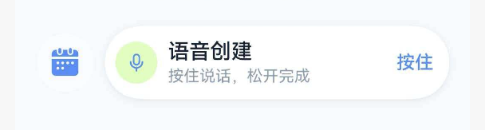

# 四时清单 UI System V2 — 设计规范

> 创建时间：2026-05-20 | 最后更新：2026-05-20
> 定位：效率工具 · 清新简洁 · 轻科技感 · 结构清晰

---

## 1. 设计原则

| 原则 | 说明 |
| --- | --- |
| 克制 | 不堆装饰，每个元素都有明确功能 |
| 呼吸感 | 充足的留白，段落间有节奏 |
| 信息密度适中 | 一屏展示关键信息，不过载也不空洞 |
| 轻科技感 | 通过数据可视化、等宽数字、微光效果暗示智能 |
| 一致性 | 同类元素同样式，减少用户认知成本 |
| 重点突出 | 每个页面有且仅有一个视觉焦点区域 |

---

## 2. 色彩系统

### 主色

| Token | 浅色模式 | 深色模式 | 用途 |
| --- | --- | --- | --- |
| `primary` | `#2563EB` | `#60A5FA` | 主操作、选中态、链接、FAB |
| `primarySubtle` | `#EFF6FF` | `#1E3A5F` | 主色背景（badge、输入框聚焦） |

### 语义色

| Token | 浅色 | 用途 |
| --- | --- | --- |
| `success` | `#10B981` | 完成、正向反馈 |
| `successSubtle` | `#D1FAE5` | 完成态背景 |
| `warning` | `#F59E0B` | 注意、逾期预警 |
| `danger` | `#EF4444` | 错误、删除、逾期 |
| `info` | `#6366F1` | AI 相关、提示 |

### 中性色阶

| Token | 浅色 | 用途 |
| --- | --- | --- |
| `background` | `#FAFBFC` | 页面底色 |
| `surface` | `#FFFFFF` | 卡片底色 |
| `surfaceSoft` | `#F3F4F6` | 输入框、次级区域、未选中按钮底 |
| `surfaceOverlay` | `rgba(0,0,0,0.4)` | 遮罩层 |
| `textPrimary` | `#111827` | 标题、正文 |
| `textSecondary` | `#6B7280` | 辅助说明 |
| `textMuted` | `#9CA3AF` | 占位符、禁用态 |
| `textOnPrimary` | `#FFFFFF` | 主色按钮上的文字/图标 |
| `borderColor` | `#E5E7EB` | 分割线、卡片边框、未选中圆圈 |

---

## 3. 字体层级

| 层级 | 字号 | 字重 | 行高 | 用途 |
| --- | --- | --- | --- | --- |
| Display | 24px | Bold | 32px | 页面主标题（仅首页问候） |
| PageTitle | 24px | Medium | 32px | 页面标题（AppPageHeader） |
| HeroTitle | 20px | Bold | 28px | 英雄区标题 |
| SectionTitle | 18px | Bold | 24px | 区块标题（今日计划、目标进度） |
| Body | 16px | Regular | 22px | 正文、描述、列表项标题 |
| Meta | 14px | Regular | 20px | 辅助说明、次级信息 |
| Caption | 12px | Regular | 18px | 辅助信息、时间戳、badge 文字 |
| NumericLG | 30px | Bold (等宽) | 38px | 大数字（统计页） |
| NumericMD | 24px | Bold (等宽) | 30px | 中数字（进度百分比、计数） |

### 字体选择
- 中文：HarmonyOS Sans SC（已集成）
- 数字/英文：系统默认等宽字体

---

## 4. 间距系统

基于 4px 网格：

| Token | 值 | 用途 |
| --- | --- | --- |
| `2xs` | 4px | 图标与文字最小间距 |
| `xs` | 6px | 紧凑元素间距 |
| `sm` | 8px | 紧凑元素间距、badge 内边距 |
| `md` | 12px | 卡片内元素间距 |
| `card` | 16px | 卡片内边距 |
| `lg` | 20px | 页面左右边距 |
| `xl` | 24px | 区块间距（section gap） |
| `2xl` | 32px | 大区块间距 |

### 页面边距
- 页面左右（PAGE_PADDING）：20px
- 区块间距（SECTION_GAP）：20px
- 内容间距（CONTENT_GAP）：14px
- 面板间距（PANEL_GAP）：16px

### 页面层级（Tier）
- **Compact**（高频执行页：今日、行动、目标）：页面边距 16px，区块间距 14px
- **Comfortable**（创建/编辑/设置页）：页面边距 24px，区块间距 24px

---

## 5. 圆角

| Token | 值 | 用途 |
| --- | --- | --- |
| `sm` | 8px | 小 badge、标签、内嵌小卡片 |
| `md` | 14px | 主卡片、目标卡片、输入框 |
| `lg` | 18px | 大卡片、弹窗 |
| `xl` | 22px | 底部面板、按钮 |
| `pill` | 999px | 胶囊按钮、搜索框、圆形按钮 |

---

## 6. 阴影

| 层级 | 值 | 用途 |
| --- | --- | --- |
| 无 | — | 内嵌次级卡片 |
| 轻 | `0 1px 4px rgba(0,0,0,0.03)` | 目标卡片、列表项 |
| 中 | `0 4px 10px cardShadow` | 普通卡片 |
| 强 | `0 6px 16px cardShadow` | 焦点卡片（今日计划）、raised 卡片 |
| 浮动 | `0 10px 22px cardShadow` | 悬浮按钮、弹窗 |
| FAB | `0 3px 10px rgba(37,99,235,0.25)` | 语音悬浮按钮（带主色） |

---

## 7. 图标规范

### 渲染策略
所有图标通过 `AppIcon` 组件统一渲染，优先使用 **HarmonyOS 系统符号（SymbolGlyph）**，自动 fallback 到手绘矢量图形。

- **系统符号**：风格统一、支持多色渲染、自动适配深色模式、矢量无损缩放
- **手绘 fallback**：仅在系统符号不可用时（`useSystemSymbol: false`）使用
- **覆盖范围**：全部 60+ 个图标名称均已映射到系统符号

### 图标名称清单

| 分类 | 图标名 | 系统符号 | 用途 |
|---|---|---|---|
| **导航** | `chevron-left/right/up/down` | `sys.symbol.chevron_*` | 方向导航 |
| **操作** | `plus` `minus` `close` `search` | `sys.symbol.plus/minus/xmark/magnifyingglass` | 基础操作 |
| **状态** | `success` `warning` `info` `help` | `sys.symbol.checkmark/exclamationmark_triangle_fill/info_circle/questionmark_circle` | 反馈状态 |
| **核心功能** | `today` `task` `goal` `reminder` `focus` `calendar` | `sys.symbol.house/list_checkmask/flag/bell_fill/timer/calendar` | 主功能 |
| **提醒类型** | `habit` `milestone` `counter` `countdown` | `sys.symbol.arrow_triangle_2_circlepath/star/plus_circle/hourglass` | 提醒事件类型 |
| **数据** | `stats` `progress` `plan` `action` `review` | `sys.symbol.chart_bar/chart_bar_fill/list_clipboard/bolt/eye` | 数据与计划 |
| **账户** | `profile` `gear` `wallet` `archive` `sync` | `sys.symbol.person/gearshape/creditcard/archivebox/arrow_triangle_2_circlepath` | 账户设置 |
| **内容** | `note` `idea` `spark` `ai` | `sys.symbol.doc_text/lightbulb/sparkles/sparkles` | 内容与智能 |
| **语音媒体** | `voice` `noise` `rain` `storm` `wind` `water` `bird` `radio` | `sys.symbol.mic/speaker_wave_2/cloud_rain/cloud_bolt/wind/drop/music_note/radio` | 语音与白噪音 |
| **操作动作** | `edit` `delete` `share` `filter` `sort` `copy` `link` | `sys.symbol.pencil/trash/square_and_arrow_up/line_3_horizontal_decrease/arrow_up_arrow_down/doc_on_doc/link` | 内容操作 |
| **安全** | `lock` `unlock` `eye` `eye-off` | `sys.symbol.lock/lock_open/eye/eye_slash` | 安全与可见性 |
| **装饰** | `star` `star-fill` `heart` `flag` `tag` `location` `time` `date` | `sys.symbol.star/star_fill/heart/flag/tag/location/clock/calendar` | 语义装饰 |
| **分类** | `health` `growth` `finance` `joy` | `sys.symbol.heart_fill/chart_line_uptrend_xyaxis/yensign_circle/face_smiling` | 目标分类 |

### 尺寸规范

| Token | 值 | 说明 |
| --- | --- | --- |
| `ICON_SIZE_XS` | 16px | Badge/标签内、卡片辅助图标 |
| `ICON_SIZE_SM` | 22px | 列表项前导图标、按钮内图标 |
| `ICON_SIZE_MD` | 28px | 中等场景 |
| `ICON_SIZE_LG` | 32px | 大图标 |
| `ICON_SIZE_XL` | 38px | 特大图标、空状态 |

| 场景 | iconSize | 说明 |
| --- | --- | --- |
| 底部导航 | 24px | Tab 图标（NAV_ICON_SIZE） |
| 快速操作按钮内 | 22px | 白色反色，在 44px 圆内居中 |
| 语音 FAB 内 | 20px | 白色反色，在 46px 圆内居中 |
| 列表项前导图标 | 22px | 带 framed 背景 |
| 卡片内辅助图标 | 16px | 无 frame，纯线条 |
| Badge/标签内 | 14px | 紧凑场景 |
| 搜索/工具图标 | 15px | 在 30px 圆内居中 |

### 居中规则
- **必须使用 `Stack({ alignContent: Alignment.Center })` 包裹背景容器 + AppIcon**
- 不要用 `Row` + `justifyContent(FlexAlign.Center)` 放置图标（会导致偏移）
- 背景容器和 Stack 的 width/height 必须一致

### 颜色规则

| 场景 | 图标颜色 |
| --- | --- |
| 实色按钮内（primary/danger） | `textOnPrimary`（白色） |
| 浅色背景按钮内 | `primary` 或 `textSecondary` |
| 列表项前导 | 由 `framed: true` 自动处理（tone 决定颜色） |
| 禁用态 | `textMuted`（通过 `muted: true`） |
| 逾期/错误 | `danger` |
| 完成 | `success` |
| 删除操作 | `danger`（delete 图标默认 tone） |

### 使用示例

```typescript
// 带背景框（framed，自动 tone 颜色）
AppIcon({ name: 'goal', iconSize: ICON_SIZE_SM })

// 无背景框（纯图标，指定颜色）
AppIcon({ name: 'chevron-right', iconSize: 14, framed: false, color: themeColors.textMuted })

// 实色按钮内（白色图标）
AppIcon({ name: 'voice', iconSize: 20, framed: false, color: themeColors.textOnPrimary })

// 危险操作
AppIcon({ name: 'delete', iconSize: ICON_SIZE_SM, framed: false, color: themeColors.danger })

// 新增图标（edit/delete/share/filter/sort/copy/link/lock/eye 等）
AppIcon({ name: 'edit', iconSize: ICON_SIZE_XS, framed: false, color: themeColors.primary })
```

---

## 8. 卡片规范

### 主卡片（独立区块）
- 背景：`surface`（白色）
- 圆角：`lg`（18px）
- 阴影：中（`0 4px 10px cardShadow`）
- 内边距：16px
- 边框：1px `borderColor`

### 焦点卡片（页面核心区域，如今日计划）
- 背景：`surface`
- 圆角：`lg`（18px）
- 阴影：强（`0 6px 16px cardShadow`）
- 左侧色条：4px 宽，`primary` 色，通过 `border({ width: { left: 4 } })` 实现
- 内边距：16px

### 次级卡片（嵌套在主卡片内）
- 背景：`surfaceSoft`
- 圆角：`sm`（8px）
- 无阴影
- 内边距：12px

### 提示条（逾期、错误）
- 背景：语义色的浅色变体（如 `#FEF2F2`）
- 圆角：`sm`（8px）
- 边框：1px 语义色浅色（如 `#FECACA`）
- 内边距：12-14px

---

## 9. 按钮规范

### 主按钮（Primary）
- 背景：`primary`
- 文字/图标：`textOnPrimary`
- 圆角：`xl`（22px）
- 高度：48px（大）/ 42px（中）/ 36px（小）

### 次级按钮（Secondary）
- 背景：`surface`
- 边框：1px `borderColor`
- 文字：`textPrimary`
- 圆角：同主按钮

### 幽灵按钮（Ghost/Text）
- 无背景、无边框
- 文字：`primary`
- 用于"查看全部"、"生成 AI 计划"等文字链接

### 快速操作按钮（首页专用）
- 容器：44px 圆形，`primary` 实色背景
- 图标：22px，白色
- 阴影：轻 FAB 级别
- 下方文字：Caption（12px），`textSecondary`
- 居中方式：`Stack({ alignContent: Alignment.Center })`

### 悬浮按钮（FAB）
- 容器：46px 圆形，`primary` 实色背景
- 图标：20px，白色
- 阴影：FAB 级别（带主色）
- 位置：页面右下角，距底 16px，距右 16px

---

## 10. 弹窗与遮罩规范

### 遮罩层
- 背景：`surfaceOverlay`（`rgba(0,0,0,0.4)`）
- 点击遮罩关闭弹窗（除非有进行中的操作）
- 遮罩层 zIndex：20

### 底部弹出面板（Bottom Sheet）
- 从底部滑入
- 圆角：顶部 22px，底部 0
- 背景：`surface`
- 内边距：24px（顶部）/ 16px（左右）/ 安全区（底部）
- 最大高度：屏幕 80%
- 内容超出时可滚动

### 居中弹窗（Dialog）
- 居中显示
- 圆角：22px
- 背景：`surface`
- 阴影：浮动级别
- 宽度：屏幕 85%
- 内边距：24px

### 确认弹窗（Alert Dialog）
- 使用 `this.getUIContext().showAlertDialog()`
- 标题：Title 层级
- 正文：Body 层级
- 按钮：最多 3 个，右对齐

### Toast / Snackbar
- 位置：顶部或底部（距边缘 16px）
- 圆角：`md`
- 背景：`#1F2937`（深色）
- 文字：白色，Body 层级
- 自动消失：3-4 秒

---

## 11. 新手引导规范

### 引导遮罩（Spotlight）
- 遮罩：`rgba(0,0,0,0.6)`
- 高亮区域：圆角矩形镂空
- 提示气泡：白色背景，圆角 `lg`，箭头指向高亮区域
- 气泡内容：标题（Subtitle）+ 描述（Body）+ 操作按钮

### 引导步骤指示器
- 圆点样式：当前步骤 `primary`，其他 `borderColor`
- 圆点大小：6px，间距 8px

### 引导弹窗
- 居中显示
- 插图区域：顶部，高度 160px
- 标题 + 描述 + 按钮
- 可跳过（右上角"跳过"文字按钮）

---

## 12. 页面结构规范

### 首页（Today Tab）

```
┌─────────────────────────────────┐
│  问候区（Display + 日期）         │
├─────────────────────────────────┤
│  快速操作栏（4 × 46px 圆形按钮） │
├─────────────────────────────────┤
│  逾期提示条（仅有逾期时显示）     │
├─────────────────────────────────┤
│  今日计划卡片（焦点卡片 + 左色条  │
│  最多显示 7 项任务）             │
├─────────────────────────────────┤
│  今日提醒（横向滚动小卡片）       │
├─────────────────────────────────┤
│  目标进度（一行一个，进度环+标题） │
└─────────────────────────────────┘
                            [🎙️ FAB]  ← 右下角语音按钮（50px）
```

### 通用详情页

```
┌─────────────────────────────────┐
│  AppPageHeader（标题 + 返回）    │
├─────────────────────────────────┤
│  Hero 区域（关键信息摘要）        │
├─────────────────────────────────┤
│  内容区块 1                      │
├─────────────────────────────────┤
│  内容区块 2                      │
├─────────────────────────────────┤
│  操作区（固定底部或内联）         │
└─────────────────────────────────┘
```

### 创建页

```
┌─────────────────────────────────┐
│  AppPageHeader（标题 + 返回）    │
├─────────────────────────────────┤
│  AI 填入 Banner（如有）          │
├─────────────────────────────────┤
│  表单区块（卡片包裹）            │
├─────────────────────────────────┤
│  保存按钮（固定底部）            │
└─────────────────────────────────┘
```

---

## 13. 底部导航

### 形态：悬浮胶囊式（参考 HarmonyOS NEXT 系统应用）

| 位置 | 图标 | 文字 | 说明 |
| --- | --- | --- | --- |
| 1 | today (house_fill) | 今日 | 今日计划 + 提醒 + 快速操作 |
| 2 | task (list_checkmask) | 行动 | 全部任务 + 筛选 |
| 3 | goal (flag_fill) | 目标 | 目标列表 + 进度 |
| 4 | profile (person_fill) | 我的 | 会员 + 设置 |

### 视觉规范
- **形态**：悬浮胶囊（pill 圆角），不贴屏幕边缘
- **左右边距**：16px（SPACE_CARD）
- **上下内边距**：上 4px，下 8px
- **胶囊高度**：56px（BOTTOM_BAR_HEIGHT - 8）
- **胶囊圆角**：999px（RADIUS_PILL）
- **背景**：`navBackground`（浅色白色 / 深色 `#1B283B`）
- **阴影**：`radius: 16, offsetY: 4, color: cardShadow`
- **无顶部分割线**（靠阴影与内容区分）

### 图标规范
- 图标大小：24px（NAV_ICON_SIZE）
- 图标风格：**填充式（filled）**，与 HarmonyOS 系统应用一致
- 选中态：`primary` 色（图标 + 文字）
- 未选中：`textSecondary` 色
- 文字：Caption（12px），选中加粗

### 深色模式适配
- 胶囊背景自动切换为 `navBackground`（深色 `#1B283B`）
- 阴影颜色自动切换为深色 `cardShadow`（`rgba(2,10,24,0.24)`）
- 图标和文字颜色通过 `themeColors` 自动适配

---

## 14. 微交互

| 场景 | 动效 |
| --- | --- |
| 卡片按压 | scale(0.97) + 阴影收缩，150ms |
| 列表项入场 | 从下方 fade + translate(0, 8px)，错位 50ms |
| 数字变化 | 数字跳动动画（计数器效果） |
| AI 生成中 | 骨架屏 shimmer + 脉冲光效 |
| 完成任务 | 勾选动画 + 行收缩消失 |
| Tab 切换 | 内容 crossfade，200ms |
| 弹窗出现 | 从底部 slide + fade，250ms，cubic-bezier |
| 弹窗消失 | fade + 轻微下移，200ms |
| 进度条 | 宽度动画，300ms ease-out |

---

## 15. 实施优先级

| 优先级 | 内容 | 状态 |
| --- | --- | --- |
| P0 | 首页（TodayTabV2）重构 | ✅ 已完成 |
| P0 | 底部导航 Tab 结构调整（4 Tab + 去 FAB） | ✅ 已完成 |
| P0 | 信息密度优化（紧凑间距 + 更多内容） | ✅ 已完成 |
| P0 | V2 设计 Token 全局应用（所有页面统一） | ✅ 已完成 |
| P1 | 任务列表页（行动 Tab）V2 | 待做 |
| P2 | 目标 Tab（独立 GoalsTab 组件） | 待做 |
| P3 | 目标详情页 | 待做 |
| P4 | 创建流程统一（底部半屏弹出） | 待做 |
| P5 | 新手引导重构 | 待做 |
| P6 | 深色模式全面适配 | 待做 |

---

## 16. 开发约定

### 居中图标的标准写法

```typescript
// ✅ 正确：Stack 居中
Stack({ alignContent: Alignment.Center }) {
  Row()
    .width(46)
    .height(46)
    .backgroundColor(themeColors.primary)
    .borderRadius(23)
  AppIcon({ name: 'task', iconSize: 20, framed: false, color: themeColors.textOnPrimary })
}
.width(46)
.height(46)

// ❌ 错误：Row + justifyContent（图标可能偏移）
Row() {
  AppIcon({ name: 'task', iconSize: 20 })
}
.justifyContent(FlexAlign.Center)
```

### 卡片左侧色条

```typescript
// 通过 border 实现，不用嵌套 Row
Column({ space: 12 }) { ... }
.border({ width: { left: 4 }, color: themeColors.primary })
.borderRadius(14)
```

### 横向滚动列表

```typescript
Scroll() {
  Row({ space: 10 }) {
    ForEach(items, (item) => { ... })
  }
}
.scrollable(ScrollDirection.Horizontal)
.scrollBar(BarState.Off)
```
